# Quadtree image processing

What you get if you split an image into quadrants repeatedly, focusing on the quadrants with the most error compared to the original image.

Some might use this as a form of image compression, but -- *Marge voice* -- I just think they're neat.

Now with animations! These can be either gifs, or animated PNGs. Gifs are a bit more limited, they start to 'shimmer' because the file format has a limited color palette. Gifs can also take a very long time to encode, apparently due to the palette calculations once the image uses more than 256 colors. Animated PNG encodes much more quickly and avoids the shimmer. For both formats, resizing them improves the code speed and final file size.

Output format is auto-selected using the output file extension.

# Examples

The most interesting results seem to be images with large areas of low contrast but some areas of high contrast. This gives a wide range of ending quadrant sizes.

## Dolphin

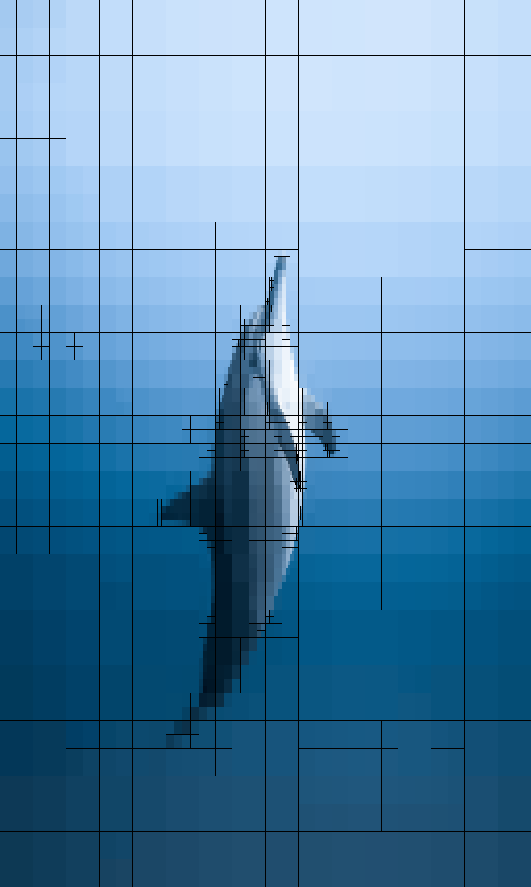

## Moon & stars

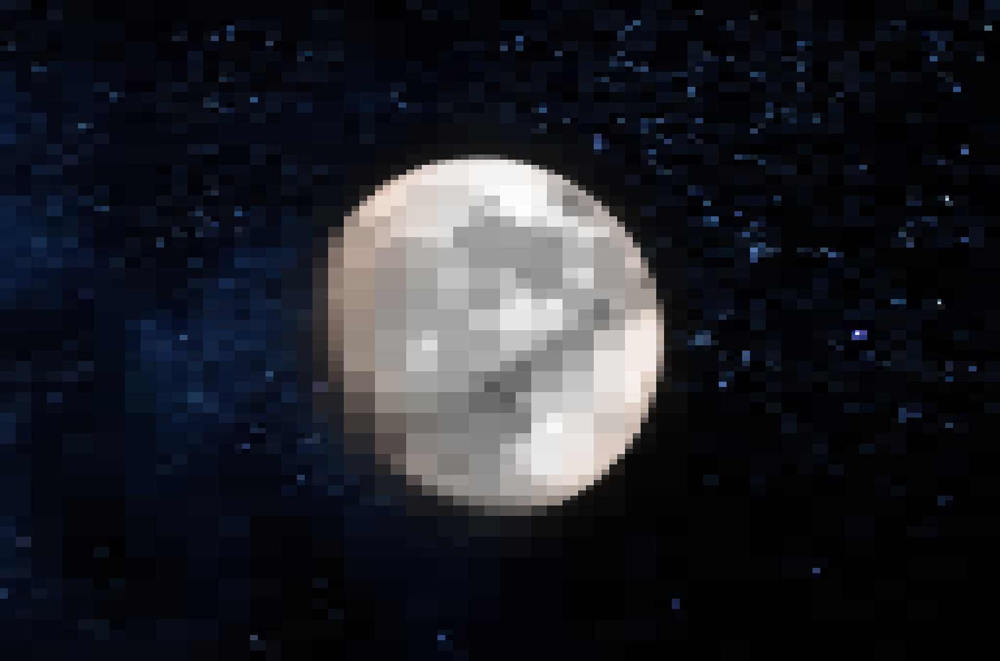
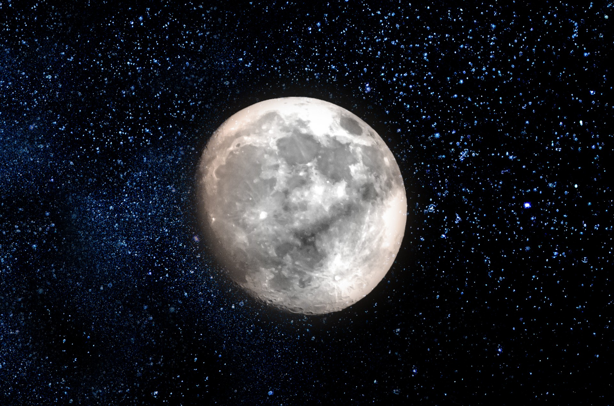

## Mountains

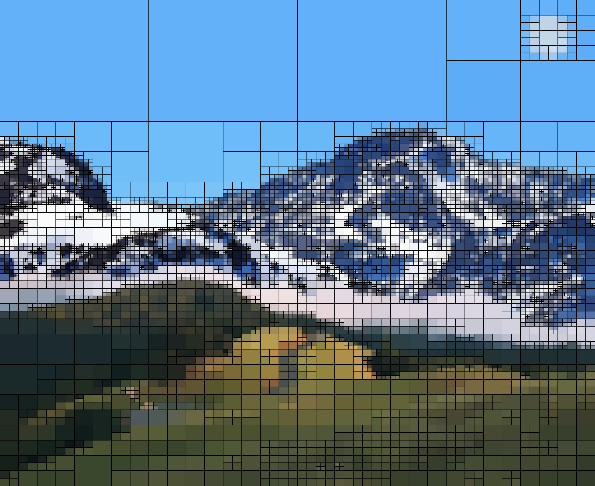
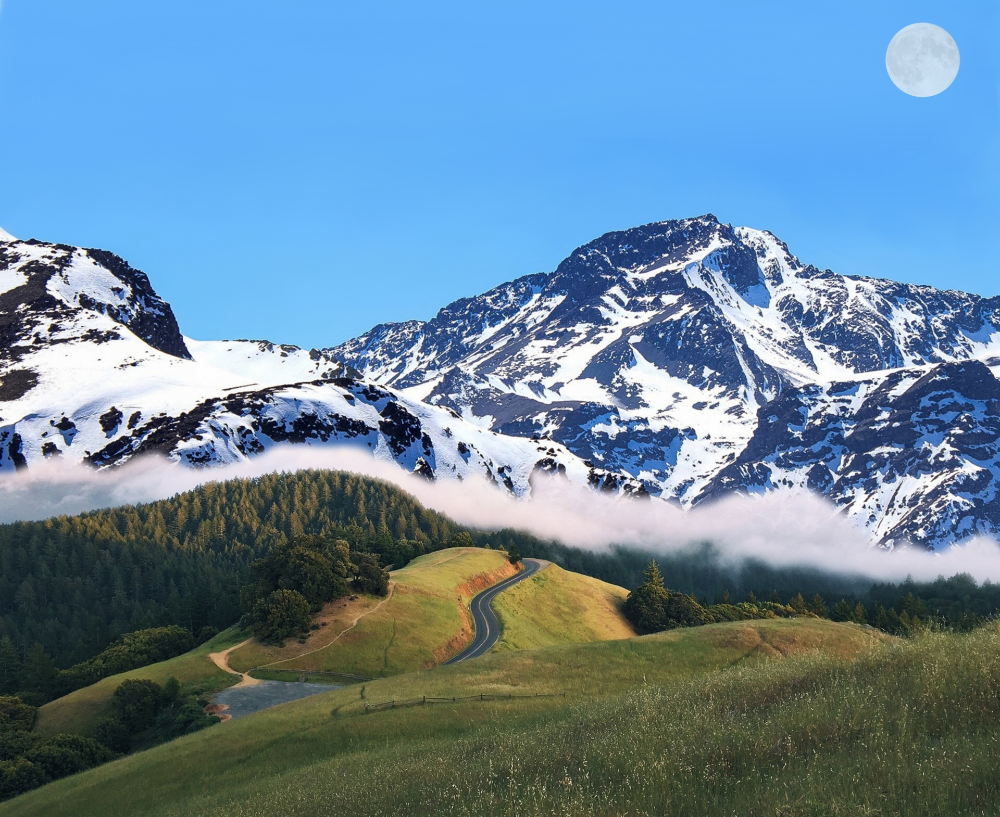

## Philadelphia skyline

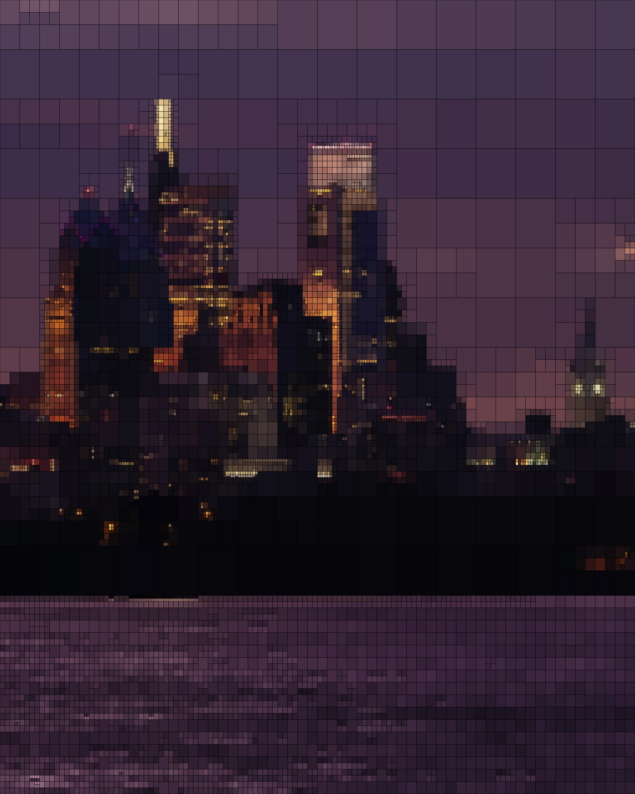
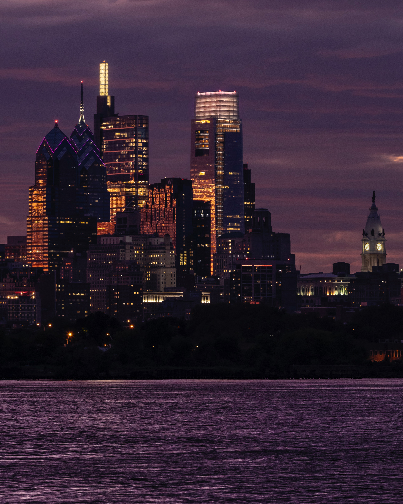

## Pluto

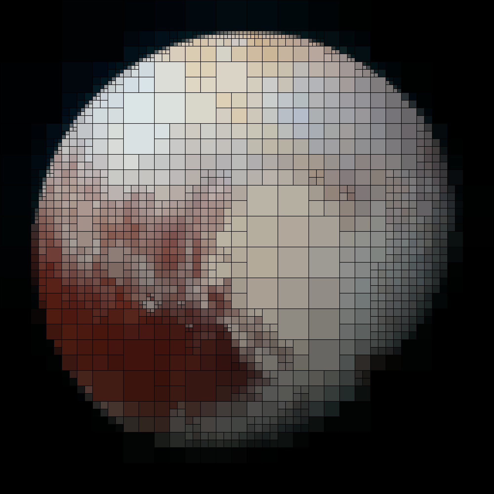

## Sunflower

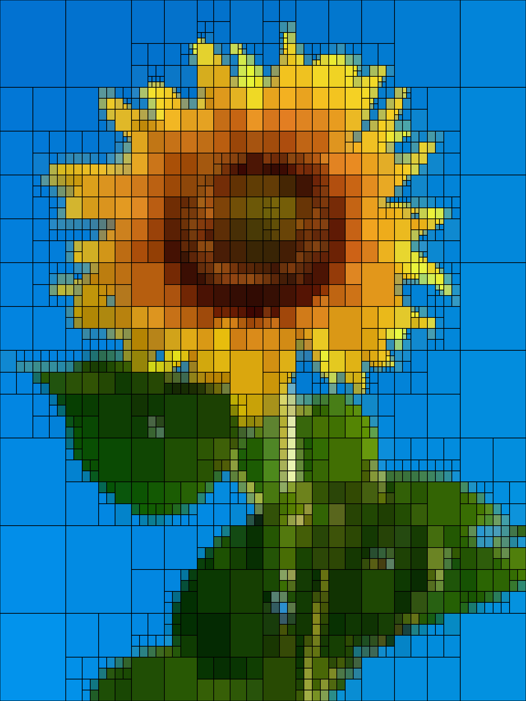

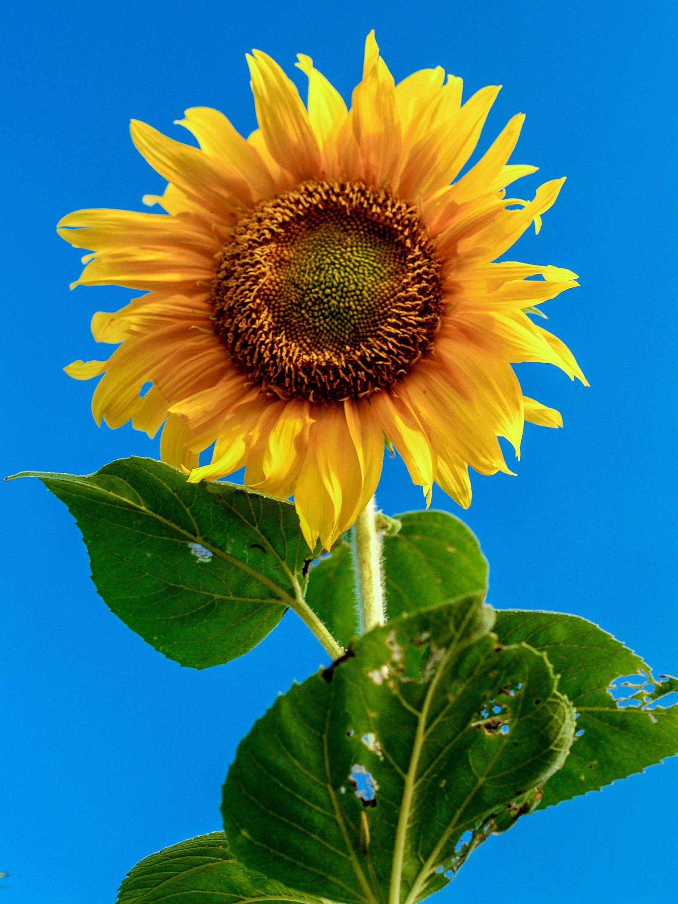

## Tropical

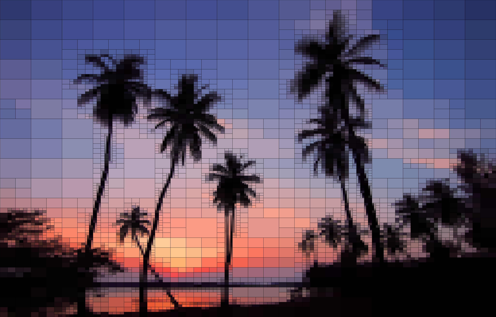

## Wolf sun

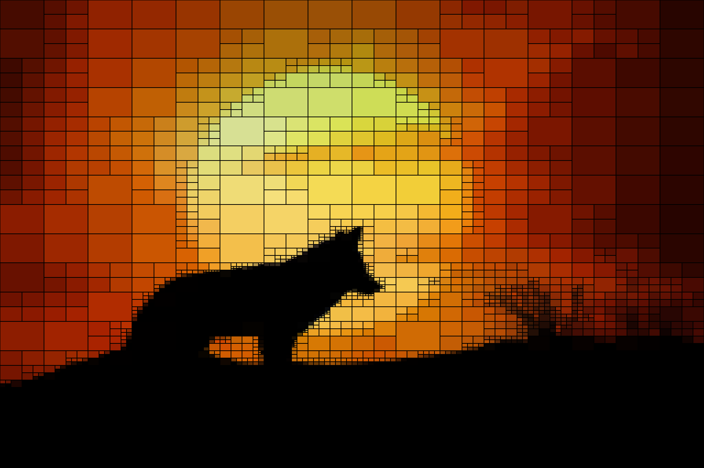
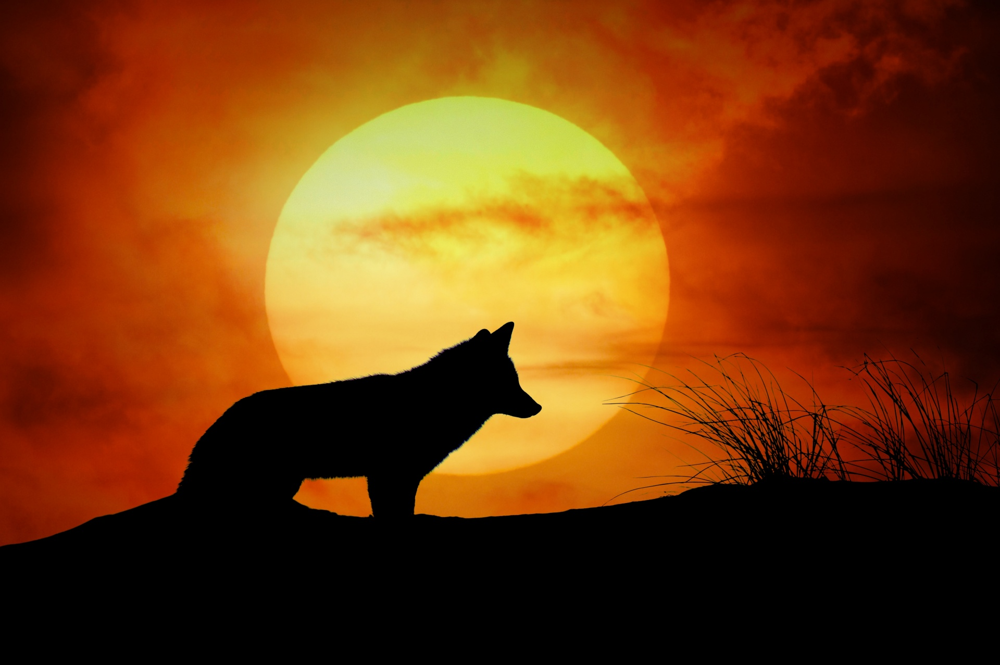

# References

Some inspiration from:
- https://github.com/AlexEidt/Quart
- https://jrtechs.net/photography/segmenting-images-with-quadtrees
